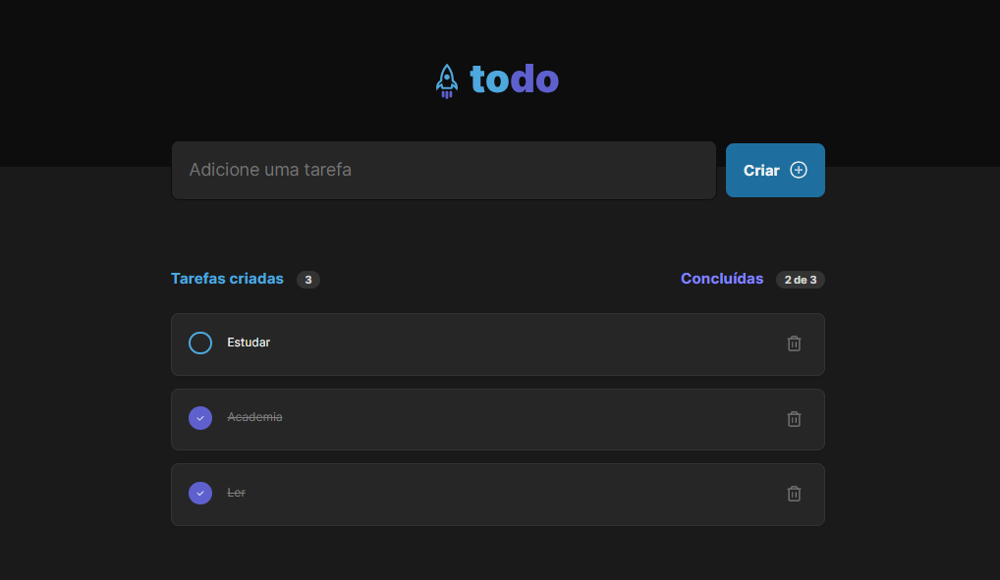
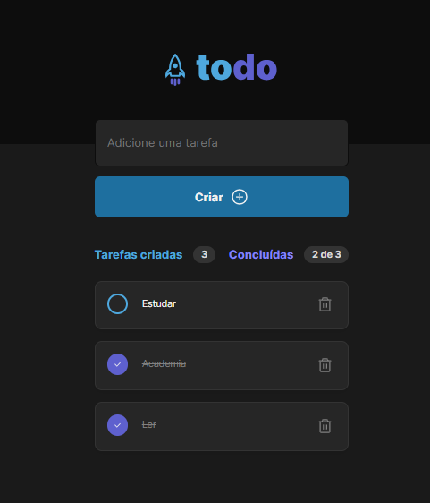

<h1 align="center" style="text-align: center;">
  
</h1>

- Desafio 01 - Trilha ReactJS do Ignite da Rocketseat.
- Uma simples aplicação de lista de tarefas desenvolvida em React e TypeScript para ajudar a gerenciar suas tarefas diárias.

## 💻 Tecnologias Utilizadas

- React
- TypeScript
- CSS Modules
- Vite

## 📁 Funcionalidades

- Adicionar novas tarefas.
- Marcar tarefas como concluídas.
- Excluir tarefas da lista.


<<<<<<< HEAD
=======
<p align="center" style="text-align: center;></p>
>>>>>>> ed096bc7a0af799d8331c3399d32a8632e4e20a4

## 💡 Instalação e Uso

A aplicação está disponível para utilização [aqui](https://to-do-list-ihb1qc3j6-viniciusiunes.vercel.app/).

Você também pode executá-la em sua máquina. Certifique-se de ter o `Node.js` instalados antes de prosseguir com as etapas abaixo:

1. Clone o projeto:

```
$ git clone https://github.com/viniciusIunes/ToDoList.git
```

2. Acesse a pasta do projeto:

```
$ cd todo-list
```

3. Instale as dependências:

```
$ npm install
```

4. Inicie o servidor:

```
$ npm run dev
```

## Contribuição

### Contribuições são bem-vindas! Se você deseja melhorar ou adicionar recursos a este projeto, siga estas etapas:

- Crie uma nova branch com sua funcionalidade:`git checkout -b minha-funcionalidade`.
- Faça as alterações desejadas e faça commit: `git commit -m  'Adicionando nova funcionalidade' `.
- Faça push para a branch: `git push `origin minha-funcionalidade.
- Envie um pull request para este repositório.

## 📝Licença

Este projeto é licenciado sob a Licença MIT - consulte o arquivo LICENSE para obter detalhes.

---

Desenvolvido por Vinícius Moreira 👋🏾

<div style="display: flex;">
  <a href="https://www.linkedin.com/in/vin%C3%ADcius-moreira-01a398177/" target="_blank"></a>
  <a href="mailto:vinicius1054@gmail.com@gmail.com"></a>
  <a href="https://www.instagram.com/_viniciusiunes/" target="_blank"></a>
</div>
